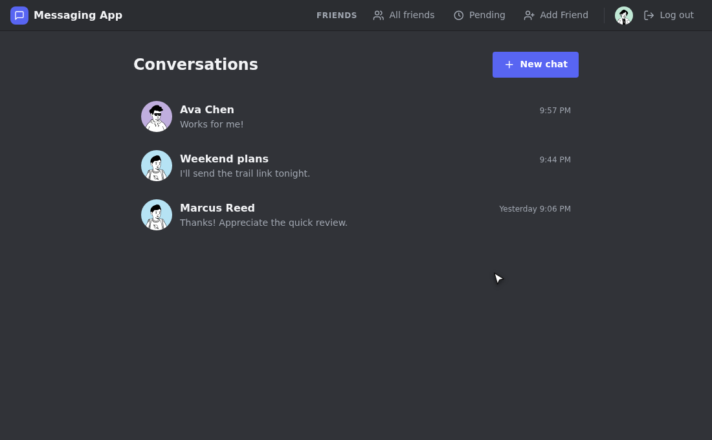
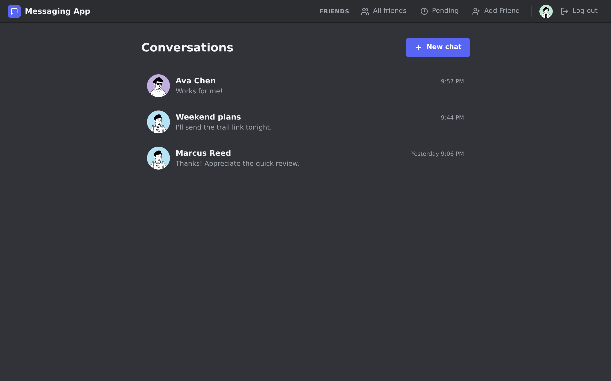
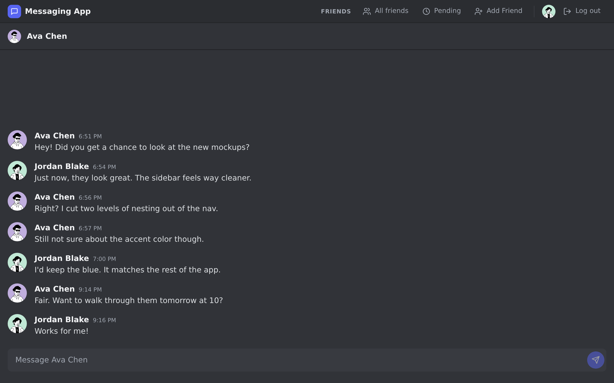

# Messaging App

A full-stack Discord-inspired messaging app. [Live Demo](https://raphs-messaging-app.netlify.app/login) | [API Repo](https://github.com/RaphaelM20/messaging-app-api)



## Features

- JWT authentication (sign up, log in, guest access)
- Send and receive messages; new ones appear automatically (polled every 4 seconds)
- Delete your own messages
- Create group or direct message conversations
- Friend requests (send, accept, deny)
- User profiles with profile picture
- Search for users to add as friends

## Tech Stack

- React, React Router, Vite
- Node.js, Express, Passport.js
- PostgreSQL, Prisma ORM
- Deployed on Netlify, Render, Neon

## Running Locally

```bash
# Clone both repos
git clone https://github.com/RaphaelM20/messaging-app
git clone https://github.com/RaphaelM20/messaging-app-api

# Backend
cd messaging-app-api
npm install
# create .env with DATABASE_URL and JWT_SECRET
npx prisma migrate dev
npm run dev

# Frontend
cd messaging-app
npm install
cp .env.example .env   # sets VITE_API_URL=http://localhost:3000
npm run dev
```

Visit `http://localhost:5173` and sign up to explore. **Continue as Guest** needs a `guest` account (password `guest123`) in your local database; create it through the sign-up form if you want the button to work locally.

## Screenshots

| Conversations | Chat |
| --- | --- |
|  |  |
